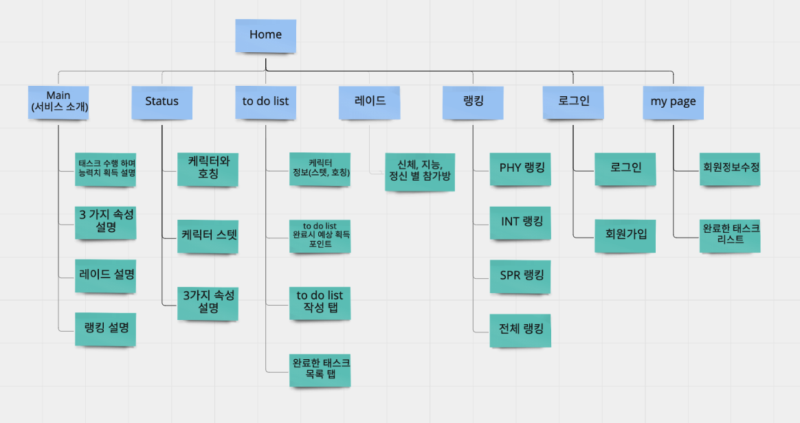
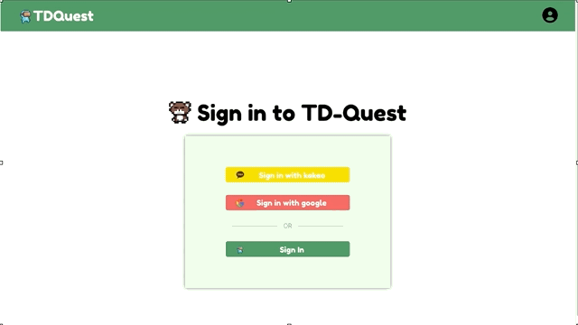
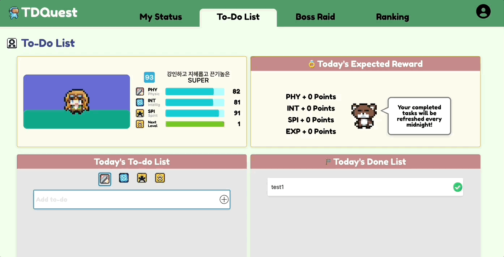
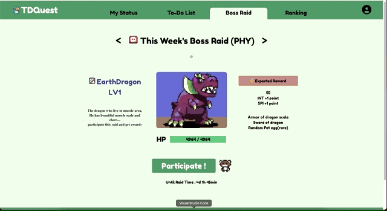
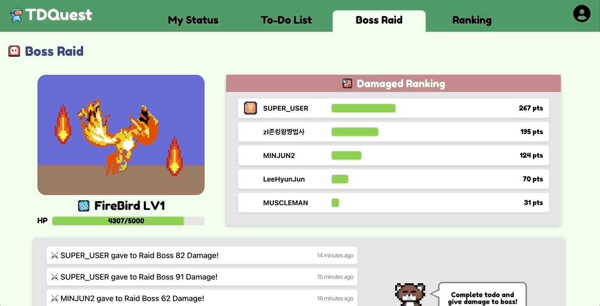
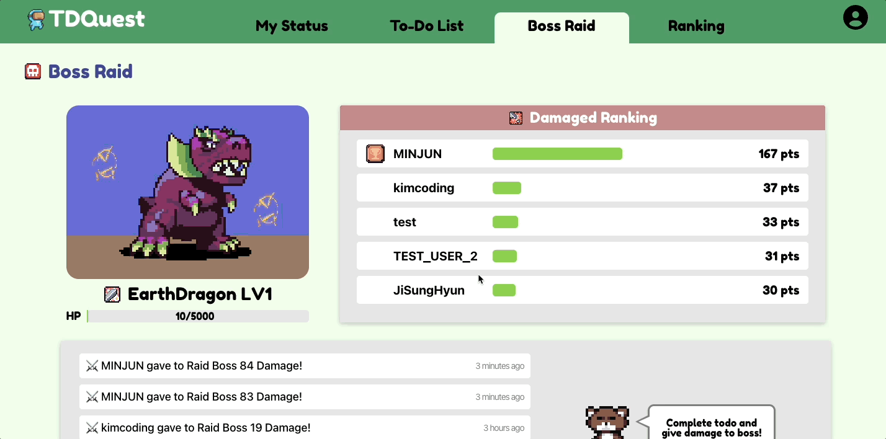
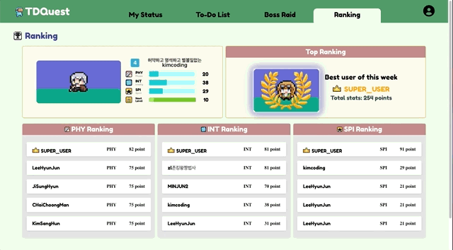
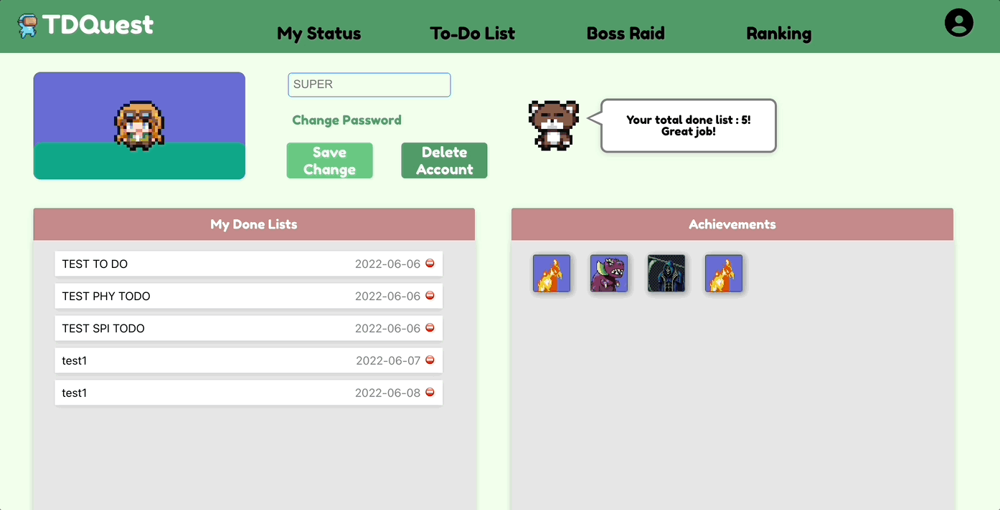

# TDQuest

---

TDQuest는 To-do list와 게임 요소를 결합하여, Todo를 좀 더 흥미롭게 진행할 수 있게 만들어주는 Web App입니다.

> **개발기간** : 2022.04.20~2022.06.08
> 

> **Contributions**
> 

---

- Role : Team Member
- Position : Front-end
- Stack : **TypeScript**, **React JS**, **Redux-toolkit**, **Styled-Component**
- Works :
    1. UI/UX, Proto-Type Design
    2. Common Component (Toast, Modal, Button, Status)
    3. My Status, My Page, Raid Page 구현
    4. Overall Bug Fix
    

> **초기 기획**
> 

---

- **기능리스트**
    
    ---
    
    ### 1. Status 페이지
    
    
    
    ### [Bareminimum]
    
    - 유저 캐릭터 랜더링
    - 유저 직업 및 칭호 랜더링
    - 유저 스탯 랜더링
    - 유저 경험치 랜더링
    - 유저 스탯 도표 랜더링
    
    ### [Advanced]
    
    - 장비 목록과 해당 장비의 능력 수치 렌더링
    
    ---
    
    ## 2. To do 작성 페이지
    
    
    
    ### [Bareminimum]
    
    - to do list 생성(스탯 항목 클릭 후)
    - to do list 수정
    - to do list 완료
    - to do list 삭제
    - to do list 완료시 경험치, 스탯, 레벨, 직업 업데이트
    - to do list 완료시 레이드 몬스터에게 입힌 누적 데미지 정보, 데미지 로고 업데이트
    - to do list 완료시 랭킹 업데이트
    - 미완료된 유저 to do list 렌더링
    - 완료한 오늘 to do list 렌더링
    - 오늘 상승한 경험치 및 스탯 렌더링
    
    ### [Advanced]
    
    - 글을 작성할 때, 자동으로 밑에 비슷한 내용을 검색해서 목록을 보여주는 기능
    - My routine to do List 생성
    
    ---
    
    ## 3. 랭킹 페이지
    
    
    
    ### [ Bareminimum ]
    
    - 스탯 순위 렌더링
    
    ---
    
    ## 4. 레이드 참가 페이지
    
    
    
    ### [Bareminimum]
    
    - 레이드 참가하기
    - 속성 별 몬스터 렌더링
    - 몬스터 이름, 레벨, HP, 보상 렌더링
    
    ---
    
    ## 5. 레이드 페이지
    
    
    
    ### [Bareminimum]
    
    - 데이지 많이 넣은 순서 랭킹 렌더링
    - 참가한 사람 렌더링
    
    # 5. 마이 페이지
    
    (모달창)
    
    
    
    ### [Bareminimum]
    
    ### (1) 비밀번호 수정
    
    - 비밀번호와 비밀번호 확인 모달창으로 띄워서 수정하는 기능
    
    ### (2) 회원탈퇴
    
    - 모달창을 띄워서, “정말 회원탈퇴하시겠습니까? 확실하다면 닉네임을 기입해주십시오"라는 메세지와 함께 다시확인하는 창
    
    ### (3) 로그아웃
    
    - 로그아웃 모달창 띄워서, “로그아웃하시겠습니까" 메시지 확인창
    
    ## 6. 로그인 페이지
    
    
    
    [Bareminimum]
    
    - 로그인 기능
    
    [Advaced]
    
    - Oauth 2.0을 이용한 로그인 기능
    
    ## 7. 회원가입 페이지
    
    
    
    ### [Bareminimum]
    
    - 유효성 검사
- **프로젝트 스케쥴**
    
    ---
    
    # W1(~20.04.2022) - Idea 기획
    
    # W2(~27.04.2022) - 요구사항, 디자인
    
    - Munu Structure (페이지 구조)
    - 웹앱 컨셉 디자인
    - 프로토타입
    - task 생성
    - 업무 분담
    
    # W3(~04.05.2022) - 배포자동화 세팅
    
    - DB, API설계
    - AWS IM 권한 설정
    - 
    - 배포자동화 세팅
    - 두개의 Sprint 로 분할
    
    # W4(~11.05.2022) - Sprint1
    
    - DB, API 설계
    - 구현
    
    # W5(~18.05.2022) - Sprint1
    
    - 구현
    - 테스트
    - 코드리뷰
    
    # W6(~25.05.2022) - Sprint2
    
    - DB, API 설계
    - ~~구현~~
    
    # W7(~01.06.2022) - Sprint2
    
    - 구현
    - 테스트
    - 코드리뷰

> **프로젝트 Structure**
> 

---

- Click to Open!
    
    ---
    
    ## 페이지 구조:
    
    
    
    ## 스택:
    
    
    
    - server
    
    
    
    - client
    
    
    
    ## 주요 기능별 시연:
    
    - 회원가입/로그인
        
        
        
    
    - 투두리스트 생성/완료/완료취소/수정/삭제
        
        
        
    
    - 레이드 참가
        
        
        
    
    - 레이드 진행
        
        
        
    
    - 레이드 완료
        
        
        
    
    - 랭킹
        
        
        
    
    - myPage
        
        
        

# Week 1,2

---

Corner Reviewer 진행 당시와 마찬가지로 다들 직장인들로 구성된 팀이었기 때문에, 개발 기간을 상당히 널널하게 잡고 진행하였다. 기획 및 디자인을 2주가량 잡고 Idea 선정 및 UI/UX, Prototype 작업을 진행했다.

UI/UX 및 Prototype은 Miro App을 통해 만들었고, 내가 담당하였다. (**초기 기획 기능리스트가 바로 Prototype 버전이다**) 기획에 대해 이거저거 찾아보면서 만들긴했지만 부족한 부분은 많다.


# Week 3

---

3주차에는 DB 및 API 문서 작성, Git과 Skeleton File로 AWS 배포 초기 세팅을 진행하였다. 개발이 끝난 지금 와서 생각하는건데, 자동 배포에 대한 기능을 그다지 활용하지 않은 것이 아쉬운 점이다.

Git 세팅은 Agile 방법론을 적용해보자는 의견에, 모든 기능 리스트들을 크게 Sprint 1,2로 나누고 1이 끝나면 다같이 2로 넘어가는 식으로 진행했다.


# Week 4

---

본격적인 코딩 작업에 착수했다. 먼저 header, footter를 CSS로 모양만 잡아주고 팀원들에게 기능 구현을 요청한 뒤 공통 컴포넌트를 만드는 작업을 진행했다. (Button, Status)

**팀원들이 이 컴포넌트를 가져가서 어떤 상황에 사용하게 될까를 고려하면서**, 옵션으로 사용할 수 있는 props와 default 값을 설정하였다. 

TypeScript를 실제 사용해보는 것이 이번이 처음이어서, props와 state에 Type을 설정하는 방법 등 기존과는 다른 점들에 시간을 조금 많이 소요했었다.

Type 또한 되도록 컴포넌트에 설정하지 않고, 다른 곳에 사용할 경우를 대비하여 **Types 폴더를 따로 만들어** 그 안에 넣은 뒤 import 해오는 방식으로 사용하려고 노력했다.

---

- **Button Component**
    
    ```tsx
    // Button 컴포넌트는 width, fontSize, padding, text를 넣어 사용할 수 있습니다.
    // 값을 지정하지 않은 경우, 기본 설정값으로 버튼이 생성됩니다.
    //! 기본 설정값 : width: 120px, fontSize: 20px, padding: null
    // text에는 버튼 안에 넣고 싶은 텍스트를 할당하면 됩니다.
    function Button({
      width, fontSize, padding, text, height, 
    	marginBottom, deactive, onClick,
    }: ButtonData) {
      return (
        <ButtonContainer
          width={width}
          fontSize={fontSize}
          padding={padding}
          height={height}
          marginBottom={marginBottom}
          deactive={deactive}
          onClick={onClick}
        >
          {text}
        </ButtonContainer>
      );
    }
    
    export default Button;
    ```
    
- **Status Component**
    
    ```tsx
    // 옵션 : onlyChar, direction
    // onlyChar = true일 경우, 캐릭터 창만 표시
    // direction은 기본적으로 column 방향이고, direction = 'row' 전달 시 가로로 표시됨
    function Status({
      charData,
      onlyChar,
      direction,
    }: {
      charData: CharDataType;
      onlyChar?: boolean;
      direction?: string;
    }): JSX.Element {
      const {
        user_id: userName,
        image: character,
        status_phy,
        status_int,
        status_spl,
        userLevel,
        userExp,
      } = charData;
    
      return (
        <MainContainer direction={direction}>
          <CharacterContainer>
            <CharacterBackground>
              <div className='character_wrapper'>
                <Character
                  src={require(`../static/images/character/${character}.png`)}
                />
              </div>
              <CharacterBackgroundBottom />
            </CharacterBackground>
          </CharacterContainer>
          {onlyChar ? null : (
            <CharacterInfoContainer direction={direction}>
              <UserNameContainer direction={direction}>
                <UserLevel>{userLevel}</UserLevel>
                <UserNameWrapper direction={direction}>
                  <UserTitle>{userTitle}</UserTitle>
                  <UserName>{userName}</UserName>
                </UserNameWrapper>
              </UserNameContainer>
              <StatusContainer>
    						<StatusDetails />
              </StatusContainer>
            </CharacterInfoContainer>
          )}
        </MainContainer>
      );
    }
    
    export default Status;
    ```
    

# Week 5

---

Sprint1 의 마무리주이기 때문에, **My Status Page** 및 **My Page**를 마무리하기로 했다. 초기 ProtoType 기획 때는 My Page를 모달 형태로 띄우기로 했는데… 중간에 팀원들의 마음이 바뀌어서 페이지 형태로 갑자기 바꾸게 되었다.

1. 사실 My Page에 렌더링할 정보가 많이 없어서 모달창으로 한 것이었기 때문에 페이지 레이아웃을 어떻게 할지가 가장 큰 고민이었다. (사실 상 이 고민 때문에 시간을 거의 다 쓰게 되었다. ProtoType이 이래서 중요하다!)

1. 기획 단계에서 Redux-toolkit을 통해 캐릭터 데이터 들을 관리하기로 했었는데, 진행하다보니 약간 생각이 부족했다는 느낌이 있었다.
    1. 초기 기획 단계는 로그인 시 `localStorage`에 DB상 캐릭터 ID 등을 셋팅하고, 이를 기준으로 `API`에서 데이터를 불러와 state에 셋팅하면 문제 없겠지! 라는 생각이었다.
    2. 그러나 `Redux state` 또한 `state`이기 때문에… 새로고침 시 데이터가 전부 초기화되어 페이지가 데이터를 읽어오지 못해 렌더링 오류로 터져버리는 문제가 빈번했다.
    3. 여기서 이제 중요한 결정을 해야될 부분이 `App.tsx`에서 새로고침할 때마다 관련된 모든 데이터를 API에서 불러와  `localStorage 셋팅` → `state 셋팅` → `각 페이지로 전달` 하느냐, 아니면 각 페이지에서 필요한 정보를 그때마다 API에서 불러오느냐의 결정을 해야했는데, 결국 `state`로 우선 가기로 했다. 
    4. 이유는 API의 오류가 많아 `state` 셋팅이 잘 안되는 것인지, 아니면 Client 쪽에서 `data flow`를 제대로 고려하지 못하고 짠 것인지 확신이 없었기 때문에… 우선 기존 기획대로 진행을 하였는데 완성 단계에 다다르니, 실시간으로 업데이트되는 `status` 정보 등을 생각하면 각 페이지에서 필요한 데이터를 그 때마다 불러오는 것이 더 좋은 생각이 아니었나 싶다.

1. 개발 중간에, `Toast` 메뉴와 `Modal` 창 또한 공통 Component로서 개발하면 좋겠다는 생각들어 작업을 진행하였다. `Modal` 창 또한 버튼이 클릭 시 함수가 실행되는 기능이 필요하다고 생각하여 관련 `props` 또한 전달 받을 수 있도록 구현하였다. 
    1. 사실 `Toast` 가 가장 고민이었는데, 원래는 함수만 불러와도 토스트 메뉴가 렌더링 되도록 만들고 싶었다. 이 때문에 Class 구조화 등등 여러가지 고민하다가 결국 컴포넌트를 불러와서 사용자가 `state`로 해당 컴포넌트를 조건부 렌더링 시키는 구조로 구현하였는데… 
    2. 나중에 생각해보니 App 최상단에 토스트 컴포넌트를 삽입하고 하위 컴포넌트 들에서 함수만을 호출하여 사용할 수 있도록 구현하는 방법이 더 좋았을 것 같다.
    
    ---
    
    - **Modal CODE**
        
        ```tsx
        import React from "react";
        import styled, { keyframes } from "styled-components";
        import { color_primary_green_dark } from "./CommonStyle";
        
        const BgFade = keyframes`
            from {
              opacity: 0;
            }
            to {
              opacity: 1;
            }
        `;
        
        const ModalFade = keyframes`
          from {
            opacity: 0;
            margin-top: -50px;
          }
          to {
            opacity: 1;
            margin-top: 0;
          }
        `;
        
        const ModalBackground = styled.div`
          background-color: #515151;
          position: fixed;
          top: 0;
          right: 0;
          bottom: 0;
          left: 0;
          z-index: 99;
          background-color: rgba(0, 0, 0, 0.6);
          animation: ${BgFade} 0.3s;
        `;
        
        const ModalContainer = styled.div`
          width: 90%;
          position: fixed;
          top: 25%;
          left: 35%;
          max-width: 450px;
          margin: 0 auto;
          background-color: white;
          overflow: hidden;
          border-radius: 5px;
          animation: ${ModalFade} 0.3s;
        `;
        
        const Header = styled.div`
          position: relative;
          padding: 16px 64px 16px 16px;
          background-color: #f1f1f1;
          font-weight: 700;
        `;
        
        const HeaderBtn = styled.button`
          position: absolute;
          top: 10px;
          right: 15px;
          width: 30px;
          font-size: 30px;
          font-weight: 700;
          text-align: center;
          color: #999;
          background-color: transparent;
          border: none;
          color: red;
          &:hover {
            cursor: pointer;
          }
        `;
        
        const ModalMain = styled.div`
          padding: 16px;
          border-bottom: 1px solid #dee2e6;
          border-top: 1px solid #dee2e6;
        `;
        
        const Footer = styled.div`
          padding: 12px 16px;
          text-align: right;
          display: flex;
          justify-content: center;
          align-items: center;
        `;
        
        const FooterBtn = styled.div<{ isConfirmed?: boolean }>`
          padding: 6px 12px;
          color: #fff;
          background-color: ${(props) =>
            props.isConfirmed ? color_primary_green_dark : "#ccc"};
          border-radius: 5px;
          font-size: 15px;
          width: 200px;
          height: 25px;
          display: flex;
          align-items: center;
          justify-content: center;
          align-items: center;
          font-weight: 600;
          &:hover {
            cursor: pointer;
          }
        `;
        
        // 필수입력값 : open, close관련 로직 -> Mypage.tsx 참고 및 header에 원하는 텍스트 입력, children
        // children : React.Node(Html 태그 집합 또는 JSX Element)
        // 옵션입력값 : footer, footerClick, isConfirmed
        // footer: string
        // footerClick: footer 부분의 버튼 클릭 시 실행 될 함수
        // isConfirmed : 해당 값에 true 전달 시 색상이 초록색으로 변경됨
        function MsgModal({
          open, close, header, children, footer, footerClick, isConfirmed,
        }: {
          open: boolean;
          close: () => void;
          header: string;
          children: JSX.Element | React.ReactNode;
          footer?: string;
          footerClick?: () => void;
          isConfirmed?: boolean;
        }) {
          return (
            <div className={open ? "open_modal" : "close_modal"}>
              {open ? (
                <ModalBackground onClick={close}>
                  <ModalContainer
                    onClick={(event) => {
                      event.stopPropagation();
                    }}
                  >
                    <Header>{header}</Header>
                    <HeaderBtn onClick={close}>&times;</HeaderBtn>
                    <ModalMain>{children}</ModalMain>
                    <Footer>
                      <FooterBtn onClick={footerClick}>
                        {footer ? footer : "Confirm"}
                      </FooterBtn>
                    </Footer>
                  </ModalContainer>
                </ModalBackground>
              ) : null}
            </div>
          );
        }
        
        export default MsgModal;
        ```
        
    - **Toast CODE**
        
        ```tsx
        import React, { useState } from 'react';
        import styled, { keyframes } from 'styled-components';
        
        const RootToast = styled.div`
          .display_none {
            display: none;
          }
          white-space: pre-wrap;
        `;
        
        const PopOver = keyframes`
          0% {
            transform: rotateZ(0);
            transform: translateX(500px);
          }
          15% {
            transform: rotateZ(-3deg);
          }
          20% {
            transform: rotateZ(3deg);
          }
          25% {
            transform: rotateZ(-1deg);
          }
          30% {
            transform: rotateZ(1deg);
          }
          35% {
            transform: rotateZ(-3deg);
          }
          40%, 100% {
            transform: rotateZ(0);
            transform: translateX(0px); 
          }
        `;
        const PopHide = keyframes`
          from {
            opacity: 1;
            transform: translateX(0);
          }
          to {
            opacity: 0;
            transform: translateX(500px); 
          }
        `;
        
        const Wiggle = keyframes`
          0%, 7% {
            transform: rotateZ(0);
          }
          15% {
            transform: rotateZ(-15deg);
          }
          20% {
            transform: rotateZ(10deg);
          }
          25% {
            transform: rotateZ(-10deg);
          }
          30% {
            transform: rotateZ(6deg);
          }
          35% {
            transform: rotateZ(-4deg);
          }
          40%, 100% {
            transform: rotateZ(0);
          }
        `;
        
        const ToastContainer = styled.div`
          .toast_wrapper {
            width: 300px;
            height: 80px;
            background-color: white;
            position: fixed;
            top: 100px;
            right: 0px;
            z-index: 999;
            border-radius: 5px;
            border-left: 5px solid green;
            box-shadow: rgba(99, 99, 99, 0.2) 1px 5px 10px 0px;
            animation: ${PopOver} 1.5s;
          }
          .hide {
            animation-delay: 3s;
            animation: ${PopHide} 1s;
          }
        `;
        
        const CloseButton = styled.button`
          border: none;
          color: transparent;
          text-shadow: 0 0 0 gray;
          background-color: transparent;
          position: absolute;
          top: 10px;
          right: 10px;
        `;
        
        const ToastBody = styled.div`
          display: flex;
          width: 100%;
          height: 100%;
          margin-left: 5%;
          align-items: center;
          font-family: 'Fredoka One', cursive;
          font-size: 15px;
        `;
        
        export function Toast({ text }: { text: string }) {
          const [showToast, setShowToast] = useState(true);
          const [hideToast, setHideToast] = useState(false);
        
          const handleClose = () => {
            setShowToast(false);
          };
        
          const HideToast = (time: number) => {
            setTimeout(() => {
              setHideToast(true);
            }, 4000);
        
            setTimeout(() => {
              setShowToast(false);
            }, time);
          };
        
          HideToast(4900);
        
          return (
            <RootToast>
              <ToastContainer className={`${showToast ? null : 'display_none'}`}>
                <div className={`toast_wrapper ${hideToast ? 'hide' : null}`}>
                  <CloseButton onClick={handleClose}>❌</CloseButton>
                  <ToastBody>{text}</ToastBody>
                </div>
              </ToastContainer>
            </RootToast>
          );
        }
        ```
        
    

> **완성된 모습 (최종)**
> 

---


# Week 6~8

---

Sprint2 스케쥴이 시작되었는데, 7주차까지는 정말 미친듯이 바빴다. (직장 일이) 

또한 Status에 따른 캐릭터 변화를 어떻게 시킬 것인지, 칭호는 어떻게 할 것인지, 보스 밸런싱은 어떻게 할 것인지 등 전체적인 게임 밸런싱에 대한 기획까지 진행하려다보니 너무 할게 많아져서 변곡점이 좀 찾아왔다.. 

따라서 세세한 Detail은 8주차에 허겁지겁하게 된 부분이 좀 아쉽다.

또한 마지막 8주차에는, 시연이 코앞인데 다른 페이지들의 버그 및 구현되지 않은 서버 기능들이 너무 많아서 서버 코드까지 일부 직접 작성하고 **전체적인 버그 Fix** 작업 및 다듬어지지 않은 **모바일 반응형 페이지 및 CSS 마무리** 작업을 진행했다. 거의 2일 동안 밤을 샜다..

- **레이드 진행**
    
    
    

- **레이드 완료**
    
    
